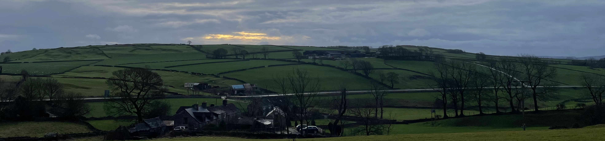

#Welcome to Sparrowpit Methodist Church

We are a friendly and inclusive rural congregation, enjoying traditional services and the well-known methodist hymns (if it's in parts so much the better)

Our regular services are at 2.45pm on the second Sunday of the month.

We are pleased to welcome our new minister Rev. Tim Morris.

Upcoming services:

| Date | Leader |
|------|--------|
| 9th Nov | Rev. Tim Morris |
| 14th Dec | Carols while we decorate the Church for Christmas |
| 21st Dec | 6pm Carol Service with Brass Band |
| 25th Dec | 6am Christmas morning service (start singing at the top of the village 5.30am) |
| 11th Jan | Rev. Tim Morris - Covenant Service |
| 8th Feb | Paul Rand |
| 8th Mar |  Rev. Tim Morris - followed by Church Council for those who wish to attend|

For up to date information on our services and events Like and Follow our [Facebook page](https://www.facebook.com/SparrowpitMethodist)

Read more about the [history](history.md) and [traditions](traditions.md) of Sparrowpit Methodists

